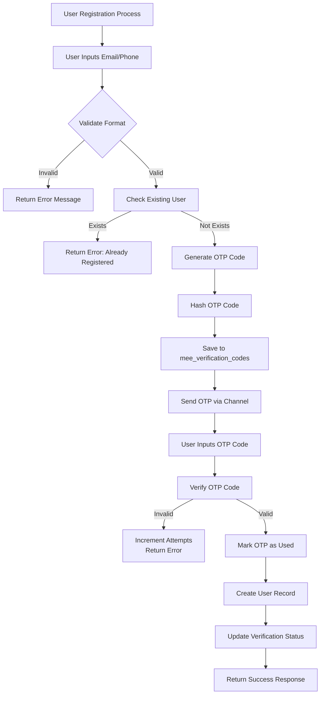
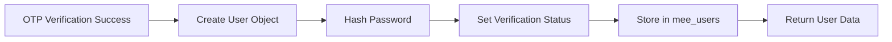
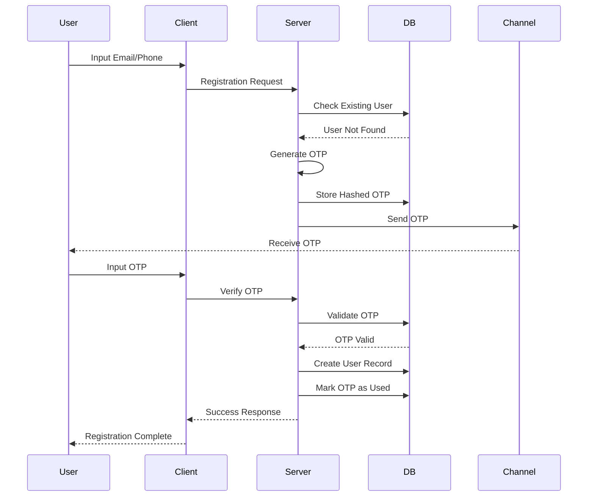
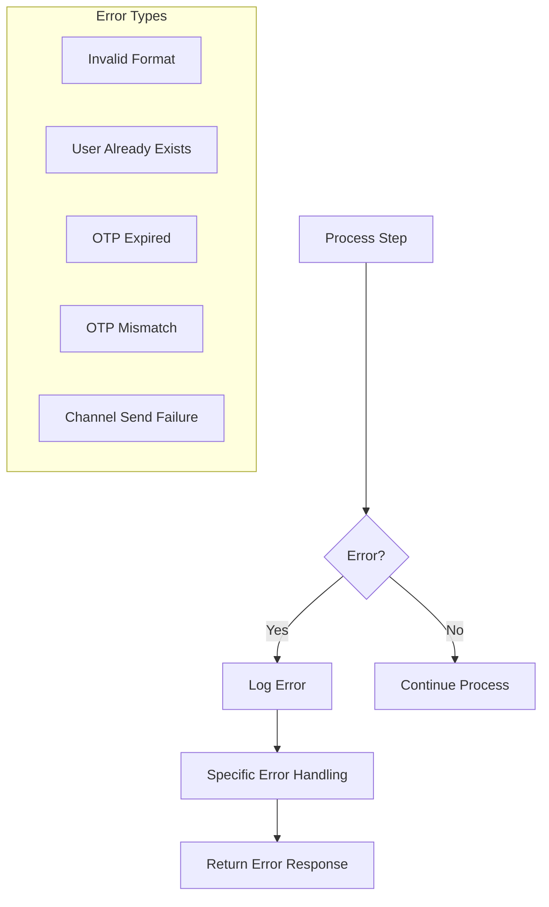

# Alur Proses Registrasi User dengan One-Time-Password (OTP)

Dokumen ini menjelaskan **Diagram Alur Proses Registrasi User dengan menggunakan OTP** melalui WhatsApp, SMS, atau Email, serta penyimpanan record di tabel **_mee_verification_codes_** dan **_mee_users_**.

Alur ini memastikan proses pendaftaran yang aman dan ramah pengguna dengan verifikasi OTP melalui berbagai saluran sambil menjaga integritas data dan praktik terbaik keamanan.

---

## Flowchart Process Registration with OTP



**Deskripsi**

Flow ini menggambarkan alur utama registrasi user dengan OTP. Proses dimulai dari input email/nomor telepon oleh user, validasi format, pengecekan apakah user sudah terdaftar, lalu sistem menghasilkan OTP dan menyimpannya. User kemudian memasukkan OTP yang dikirimkan, dan sistem memvalidasi apakah OTP valid/invalid. Jika valid, user baru dibuat dan status verifikasi diperbarui.

---

## Detailed Process Description

### 1. Initial Registration Request.


**Deskripsi**

- **Client Application:** User memasukkan email atau nomor telepon.

- **Server Validation:** Sistem memvalidasi format input (misalnya, email valid atau nomor telepon sesuai format internasional).

- **Check User Existence:** Mengecek apakah user sudah ada di tabel mee_users. Jika sudah ada → error.

- **Generate & Store OTP:** OTP dibuat, di-hash, dan disimpan di tabel mee_verification_codes.

- **Send OTP:** OTP dikirim ke user via channel yang dipilih (WhatsApp, SMS, Email).

### 2. OTP Verification Process.


**Deskripsi**

- **Submit OTP to Server:** User memasukkan OTP yang diterima.

- **Server OTP Validation:** Sistem memeriksa OTP di tabel mee_verification_codes.

- **Verify Hash & Expiry:** Validasi kecocokan hash dan batas waktu OTP. Jika expired atau salah → gagal.

- **Create User Record:** Jika valid, sistem membuat user baru di tabel mee_users.

- **Update Verification Status:** Status verifikasi user di-update menjadi “verified”.

- **Return Success Response:** Sistem mengembalikan respons sukses ke client.

---

## Database Operations Flow

### 1. OTP Storage Process.


**Deskripsi**

OTP tidak pernah disimpan dalam bentuk plain text hanya hash OTP yang disimpan di tabel. Plain text OTP hanya dikirimkan sekali ke user melalui channel (SMS/WA/Email).

### 2. User Creation Process.



**Deskripsi**

Jika OTP valid, sistem membuat object user baru. Password di-hash, status verifikasi di-set, lalu data disimpan ke tabel **_mee_users_**. Setelah itu, data user dikembalikan lagi ke client.

---

## Sequence Diagram



**Deskripsi**

Diagram ini menunjukkan interaksi antar **User → Client → Server → Database → Channel**. Alurnya step-by-step dari input email/phone hingga OTP diverifikasi dan user dibuat.

---

## Error Handling Flow



**Deskripsi**

Setiap error (misalnya format salah, OTP expired, channel gagal) akan:

- Dicatat di log,

- Ditangani secara spesifik,

- Diberikan response error ke client.

Hal ini memastikan sistem tetap robust dan tidak crash karena kesalahan input/user.

---

## Key Database Tables Structure

### 1. Tabel mee_verfication_codes

```SQL
CREATE TABLE mee_verification_codes (
    id UUID PRIMARY KEY,
    user_id UUID NULL,
    code_hash TEXT NOT NULL,
    channel VARCHAR(10) NOT NULL,
    destination VARCHAR(320) NOT NULL,
    purpose VARCHAR(20) NOT NULL,
    is_used BOOLEAN DEFAULT false,
    attempts SMALLINT DEFAULT 0,
    expires_at TIMESTAMPTZ NOT NULL,
    created_at TIMESTAMPTZ DEFAULT NOW(),
    updated_at TIMESTAMPTZ DEFAULT NOW()
);
```

**Deskripsi**

Menyimpan OTP yang sudah di-hash, channel pengiriman, status penggunaan, jumlah attempt, dan waktu expired.

### 2. Tabel mee_users

```SQL
CREATE TABLE mee_users (
    id UUID PRIMARY KEY,
    email VARCHAR(320) UNIQUE,
    handphone VARCHAR(20) UNIQUE,
    password_hash TEXT NOT NULL,
    is_email_verified BOOLEAN DEFAULT false,
    is_handphone_verified BOOLEAN DEFAULT false,
    is_verified BOOLEAN DEFAULT false,
    is_active BOOLEAN DEFAULT true,
    mfa_enabled BOOLEAN DEFAULT false,
    created_at TIMESTAMPTZ DEFAULT NOW(),
    updated_at TIMESTAMPTZ DEFAULT NOW(),
    last_login_at TIMESTAMPTZ
);
```

**Deskripsi**

Menyimpan data user, status verifikasi email/handphone, status aktif, serta flag MFA (multi-factor authentication).

---

## Best Practices Implemented

**1. Security/Keamanan:** OTP di enkripsi sebelum disimpan.

**2. Validation/Validasi:** Pemeriksaan validasi ganda.

**3. Expiration/Kadaluwarsa:** OTP kadaluwarsa setelah 5 menit.

**4. Attempt Limiting/Pembatasan Upaya:** Pembatasan upaya verifikasi OTP.

**5. Channel Flexibility/Fleksibilitas Saluran:** Dukungan untuk berbagai saluran pengiriman.

**6. Audit Trail/Jejak Audit:** Pencatatan dan pelacakan yang komprehensif.

**7. Error Handling/Penanganan Masalah:** Penanganan kesalahan yang lancar dan umpan balik pengguna.
