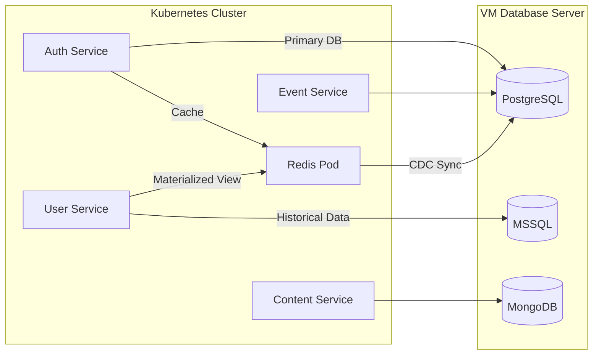
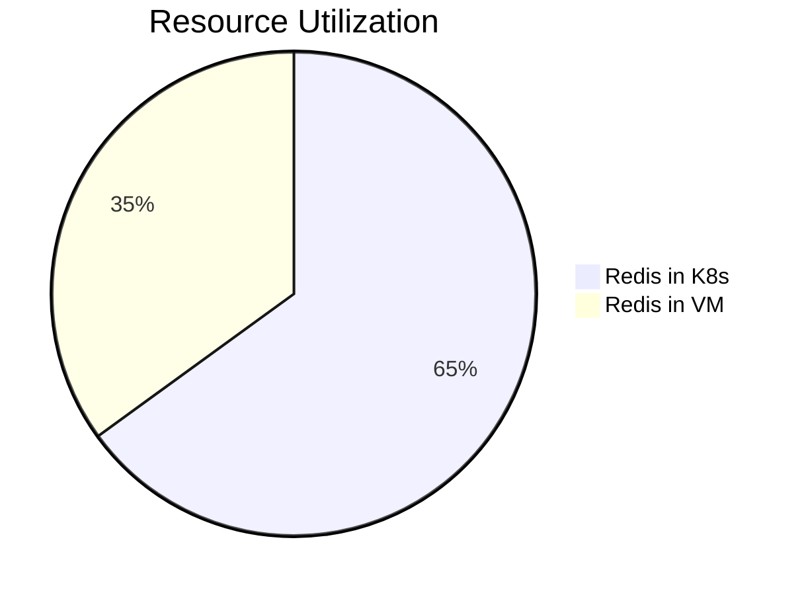
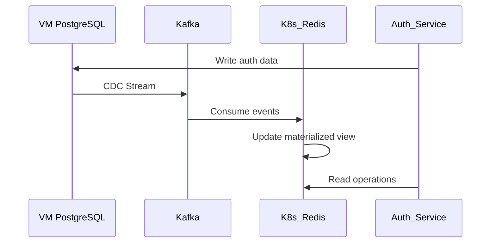

# Arsitektur Hybrid Auth-Service

Dokumen ini menjelaskan **Arsitektur Hybrid** yang direkomendasikan untuk layanan otentikasi, yang menggabungkan basis data yang dihosting di **Virtual Machine (VM)** dengan layanan aplikasi yang diimplementasikan di **Kubernetes**. Pendekatan ini menyeimbangkan kinerja, efisiensi operasional, dan kemudahan pemeliharaan.



---

## Penjelasan Arsitektur Hybrid

1. **Database tetap di Virtual Machine (VM):**

   - PostgreSQL (auth, event data).

   - MSSQL (historical data, registrations).

   - MongoDB (unstructured data, content).

**_Alasan:_** Database di VM biasanya lebih mudah di-manage, backup, dan di-tune oleh tim DBA.

2. **Redis di Kubernetes Pod:**

   - Sebagai materialized view untuk auth-service.

   - cache untuk query yang sering diakses.

   - Session storage.

3. **Koneksi dari Kubernetes ke VM Database:**

   ```yaml
   -> Contoh konfigurasi di auth-service
       database:
           postgres:
               host: "vm-db-host.company.internal"
               port: 5432
               user: "app_user"
               password: "{{ .Values.dbPassword }}"
               sslmode: "require"
   ```

---

## Mengapa Redis tetap di Kubernetes?

1. **Latency Critical:**

   - Auth service membutuhkan latency &lt;1ms untuk operasi token atau session.

   - Redis dalam pod Kubernetes → 0.1-0.5ms latency.

   - Redis di VM terpisah → 2-5ms latency (jaringan).

2. **Operational Simplicity:**

   - Lifecycle management bersama aplikasi.

   - Versioning terintegrasi dengan CI/CD.

   - Auto-scaling dengan HPA.

3. **Resource Efficiency:**



---

## Implementasi Materialized View Pattern

### Flow Data:



### Consumer Implementation:

```go
// auth-service/internal/materializedview/processor.go
func SyncAuthView() {
    consumer := kafka.NewConsumer("postgres.public.users")
    rdb := redis.NewClient(&redis.Options{Addr: "redis-auth:6379"})

    for msg := range consumer.Messages() {
        var event UserEvent
        if err := avro.Unmarshal(msg.Value, &event); err != nil {
            log.Printf("Decoding error: %v", err)
            continue
        }

        // Update Redis
        pipe := rdb.Pipeline()
        pipe.HSet(ctx, "users:"+event.ID, "email", event.Email)
        pipe.HSet(ctx, "users:"+event.ID, "status", event.Status)
        pipe.Expire(ctx, "users:"+event.ID, 48*time.Hour)
        pipe.Exec(ctx)
    }
}
```

---

## Keamanan Koneksi ke VM Database

1. **Network Security:**

```yaml
# NetworkPolicy untuk akses ke VM
kind: NetworkPolicy
metadata:
  name: allow-db-access
spec:
  podSelector:
    matchLabels:
      app: auth-service
  egress:
    - to:
        - ipBlock:
            cidr: "192.168.100.0/24" # Subnet VM
      ports:
        - protocol: TCP
          port: 5432
```

2.  **Enkripsi Data:**

        - SSL/TLS untuk koneksi database.

        - Client certificate authentication.

        ```go
        // Contoh DSN aman

    dsn := "host=vm-db-host user=app_user password=secret dbname=auth sslmode=verify-full sslrootcert=/certs/ca.pem"

        ```

---

## Best Practice Hybrid Deployment

1. **Connection Polling:**

```go
// Menggunakan pgxpool
pool, err := pgxpool.New(ctx, "postgres://...")
if err != nil {
  log.Fatal(err)
}
defer pool.Close()

```

2. **Caching Strategy:**

```go
func GetUser(id string) (User, error) {
  // Cek Redis dulu
  if user, err := rdb.Get(ctx, "users:"+id); err == nil {
      return user, nil
  }

  // Fallback ke VM database
  user, err := pgPool.QueryRow(ctx, "SELECT...")
  // Cache hasil di Redis
  rdb.Set(ctx, "users:"+id, user, 1*time.Hour)
  return user, err
}
```

3. **Monitoring Hybrid:**

```yaml
# Prometheus config
scrape_configs:
  - job_name: "vm-databases"
    static_configs:
      - targets: ["vm-db-host:9187"] # PostgreSQL exporter
  - job_name: "kubernetes-services"
    kubernetes_sd_configs: [...] # Redis, aplikasi
```

---

## Perbandingan Performa

<table>
  <thead>
    <tr>
      <th>Scenario</th>
      <th>Latency</th>
      <th>Throughput</th>
      <th>Complexity</th>
    </tr>
  </thead>
  <tbody>
    <tr>
      <td>Redis in K8s + PG in VM</td>
      <td>1-3ms</td>
      <td>10k+ RPM</td>
      <td>Medium</td>
    </tr>
    <tr>
      <td>All in VM</td>
      <td>3-8ms</td>
      <td>5k RPM</td>
      <td>Low</td>
    </tr>
    <tr>
      <td>All in K8s</td>
      <td>0.5-2ms</td>
      <td>15k+ RPM</td>
      <td>High</td>
    </tr>
  </tbody>
</table>

---

## Rekomendasi Final

1. **Pertahankan database di Virtual Machince (VM):**

   - PostgreSQL, MSSQL, MongoDB tetap di VM.

   - Manfaatkan expertise dan tooling existing.

2. **Deploy Redis dalam Kubernetes:**

   - Sebagai pod StatefulSet dengan persistent volume.

   - Untuk materialized views auth service.

3. **Gunakan Kafka untuk CDC:**

   - Sync data dari VM databases ke Redis di K8s.

   - Gunakan Debezium untuk PostgreSQL CDC.

4. **Optimasi Koneksi:**

   - Persistent connections ke VM databases.

   - Connection pooling.

   - Jitter dan retry untuk network instability.

**Dari arsitektur hybrid ini dapat memberikan:**

1. Kontrol penuh atas database di Vitual Machine (VM).

2. Performa tinggi untuk operasi kritis via Redis.

3. Operasional efisien untuk aplikasi di Kubernetes.

4. Jalan migrasi bertahap jika suatu saat ingin pindah database ke K8s.

**Untuk Implemetasi:**

```bash
# Deploy Redis cluster di K8s
kubectl apply -f redis-statefulset.yaml
kubectl apply -f redis-service.yaml

# Konfigurasi Debezium untuk PostgreSQL di VM
curl -X POST <http://kafka-connect:8083/connectors> \\
  -H "Content-Type: application/json" \\
  -d '@debezium-postgres.json'
```
