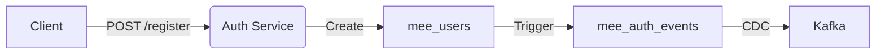
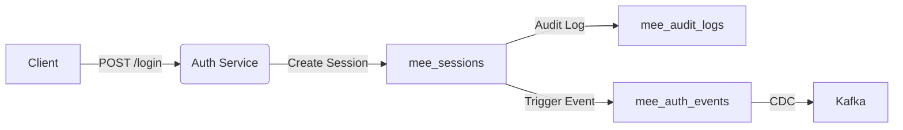
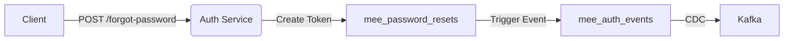
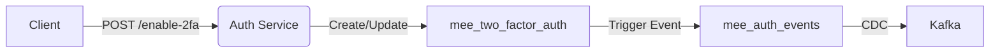

# Alur Proses Auth-Service

Dokumen ini menjelaskan alur proses yang terjadi pada **Auth-Service** beserta interaksi dengan komponen terkait dalam sistem.

---

## 1. Registrasi User:

### Deskripsi:

- Client mengirim permintaan POST /register ke Auth-Service.

- Auth-Service membuat data baru pada tabel mee_users.

- Sistem memicu event ke tabel mee_auth_events.

- Event direkam dan dikirim ke Kafka melalui mekanisme CDC (Change Data Capture).

---

## 2. Login & Session Management:

### Deskripsi:

- Client mengirim permintaan POST /login ke Auth-Service.

- Auth-Service membuat session baru pada tabel mee_sessions.

- Sistem mencatat log aktivitas pada tabel mee_audit_logs.

- Event login dipicu ke mee_auth_events lalu dikirim ke Kafka via CDC.

---

## 3. Password Reset:

### Deskripsi:

- Client mengirim permintaan POST /forgot-password.

- Auth-Service membuat token reset password pada tabel mee_password_resets.

- Sistem memicu event ke mee_auth_events.

- Event dikirim ke Kafka via CDC.

---

## 4. 2FA Management:

### Deskripsi:

- Client mengirim permintaan POST /enable-2fa ke Auth-Service.

- Auth-Service membuat atau memperbarui data 2FA pada tabel mee_two_factor_auth.

- Event dipicu ke mee_auth_events.

- Event dikirim ke Kafka melalui CDC.

---

:::note

**CDC (Change Data Capture)** adalah mekanisme yang memantau perubahan data pada database dan mengirimkannya ke sistem pesan (Kafka) untuk diproses lebih lanjut.

:::
